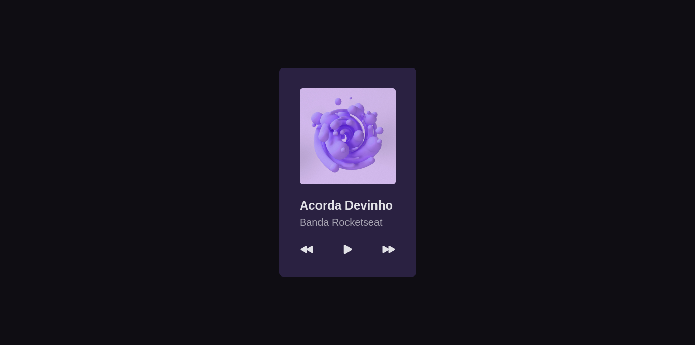

<h1 align="center"> Player de Música </h1>

  Primeiro Projeto do desafios BoraCodar da <a href="https://www.rocketseat.com.br/">Rocketseat</a>.

  <a href="#-tecnologias">Tecnologias</a>&nbsp;&nbsp;&nbsp;|&nbsp;&nbsp;&nbsp;
  <a href="#-aprendizados">Aprendizados</a>&nbsp;&nbsp;&nbsp;|&nbsp;&nbsp;&nbsp;
  <a href="#-layout">Layout</a>&nbsp;&nbsp;&nbsp;|&nbsp;&nbsp;&nbsp;
  <a href="#memo-licença">Licença</a>

  

 

  

## 🚀 Tecnologias

Esse projeto foi desenvolvido com as seguintes tecnologias:

- [React](https://reactjs.org/)
- [Node e NPM](https://nodejs.org/)
- [Vite](https://vitejs.dev/)
- [SASS](https://sass-lang.com/)

## 🤯️ Aprendizados

Esse projeto mexeu comigo, é o primeiro de muitos que vão vim por aí, e ao longo do desenvolvimento do projeto eu estava querendo realmente fazer um projeto totalmente funcional, um **player de música de verdade**. Mas escuta só:

Eu nunca fiz isso na vida... então não dava pra ficar mais de um mês tentando e tentando fazer um projeto que não precisava ser totalmente funcional, pois quem iria usar? Seguindo essa mesma ideia eu não mudei nada no layout original.

[Veja aqui o projeto online ←](https://poveii-boracodar.netlify.app/project01/)

## 🔖 Layout

Você pode visualizar o layout do projeto através [DESSE LINK](https://www.figma.com/community/file/1195050524500542670/duplicate). É necessário ter conta no [Figma](https://figma.com) para acessá-lo.

## :memo: Licença

Esse projeto está sob a licença MIT.

---

Feito com ❤️ by Poveii
