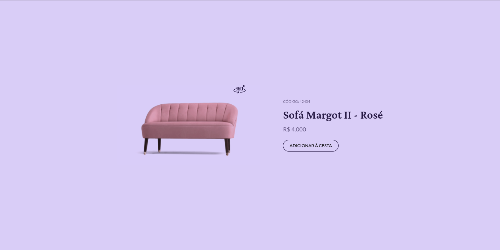

<h1 align="center"> Página de um sofá </h1>

  Segundo Projeto do desafios BoraCodar da <a href="https://www.rocketseat.com.br/">Rocketseat</a>.

  <a href="#-tecnologias">Tecnologias</a>&nbsp;&nbsp;&nbsp;|&nbsp;&nbsp;&nbsp;
  <a href="#-aprendizados">Aprendizados</a>&nbsp;&nbsp;&nbsp;|&nbsp;&nbsp;&nbsp;
  <a href="#-layout">Layout</a>&nbsp;&nbsp;&nbsp;|&nbsp;&nbsp;&nbsp;
  <a href="#memo-licença">Licença</a>

  

 

  

## 🚀 Tecnologias

Esse projeto foi desenvolvido com as seguintes tecnologias:

- [React](https://reactjs.org/)
- [Node e NPM](https://nodejs.org/)
- [Vite](https://vitejs.dev/)
- [SASS](https://sass-lang.com/)

## 🤯️ Aprendizados

Vamos lá, agora o ritmo tá vindo!! Esse segundo projeto foi algo bem simples, porque agora eu aprendi que não preciso fazer o melhor projeto que todo mundo vai usar pelo resto da vida, mas sim fazer o simples que todo mundo gosta.

Se bem que eu fiquei maluco pra fazer um modelo 3D do sofá mas não sei nem pra onde vai, precisa do Blender hahahaha enfim, olha aí o projeto!

[Veja aqui o projeto online ←](https://poveii-boracodar.netlify.app/project02/)

## 🔖 Layout

Você pode visualizar o layout do projeto através [DESSE LINK](https://www.figma.com/community/file/1195050984449538256/duplicate). É necessário ter conta no [Figma](https://figma.com) para acessá-lo.

## :memo: Licença

Esse projeto está sob a licença MIT.

---

Feito com ❤️ by Poveii
